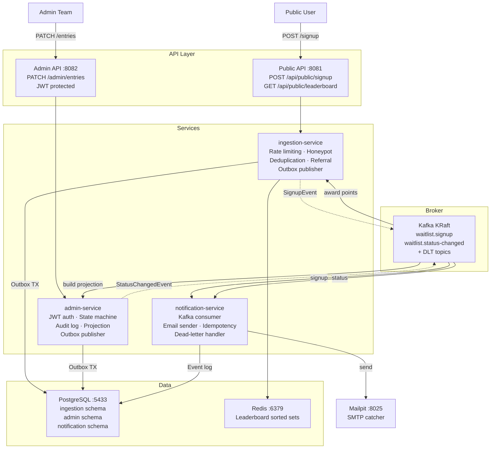

# Waitlist Platform

Three services, one `docker compose up`, and you have a working waitlist system. Users sign up on a public form, get a verification email, and receive a referral code once verified. An internal admin team reviews signups in a dashboard, moves them through a defined status workflow, and each status change triggers a notification email. There is also a referral leaderboard — users earn points when people they referred get approved.

The whole stack comes up on a laptop. First build takes roughly five to ten minutes (Gradle downloads dependencies into the image); after that it is a few seconds.

---

## What it does

- **Public signup** with email verification. No referral code is shown until the email is confirmed.
- **Referral tracking.** Each verified user gets an 8-character code. Share it; earn 10 points when a referred user gets approved. Points are reversed on rejection so the leaderboard reflects real approvals, not spam.
- **Admin dashboard** for triaging signups. Status transitions follow a defined machine: `PENDING → APPROVED → INVITED`, with `REJECTED` as an off-ramp from `PENDING` or `APPROVED`. Illegal jumps return 409. Bulk approve/reject supported with partial-failure handling.
- **Email notifications.** One email per event: verification link on signup, welcome with referral code once verified, status update on each admin action.
- **Fraud detection.** More than five referrals from the same IP within 24 hours flags the referrer for admin review. A populated honeypot field on the signup form returns a convincing fake success rather than an error.
- **Leaderboard.** All-time and current-week views. Users with zero or negative points do not appear.

---

## Stack

| Layer | Choice | Why |
|---|---|---|
| Services | Spring Boot 3.2, Java 21 | Mature, well-understood in any team. Virtual threads available if throughput becomes a concern. |
| Message broker | Apache Kafka (KRaft, no Zookeeper) | Independent consumer groups let admin and notification consume the same events without coordination. Events are replayable after a deploy gap or a bug fix — a queue would delete on ack. KRaft removes the Zookeeper container. |
| Database | PostgreSQL 18, three schemas | One instance, one migration pipeline, clear service boundaries by schema. No cross-schema queries in production code. |
| Cache / leaderboard | Redis 7, sorted sets | `ZADD`/`ZREVRANGE` are O(log N) / O(N). A `SELECT … ORDER BY` on a growing referral_points table gets expensive; Redis does not. |
| Email catcher (dev) | Mailpit | Drop-in for MailHog, actively maintained, same API and ports. |
| Frontend | React 18, Vite, Tailwind CSS, Radix UI, TanStack Query, React Hook Form, Zod | Vite for fast dev iteration. Radix for accessible primitives without fighting an opinionated component library. Zod schema definitions serve double duty — API response validation and form validation from the same source. |
| Build | Gradle 8.5, multi-project | One `./gradlew test` runs all three services. Wrapper handles the JDK. |

---

## Prerequisites

You only need **Docker Desktop** (or Docker Engine + Compose v2) to run the stack.

For the demo script: `curl` and `jq`. Both are preinstalled on macOS and most Linux distros. On Windows, `curl` ships with Windows 10+ and `jq` can be installed via `winget install jqlang.jq`.

To run tests on the host without Docker: **JDK 21**. The Gradle wrapper handles the rest.

System requirements: ~8 GB free RAM (Kafka alone takes about 1 GB), ~3 GB disk for the images, and these ports free on `localhost`:

```
8080  frontend
8081  ingestion-service
8082  admin-service
8083  notification-service
5433  PostgreSQL
9092  Kafka
6379  Redis
1025  Mailpit SMTP
8025  Mailpit UI
```

---

## Quick start

```bash
./run.sh        # macOS / Linux
.\run.ps1       # Windows
```

Builds the service images and brings up the full stack. Waits until every service health-checks green before printing the URL list.

Run the end-to-end demo:

```bash
./demo.sh       # macOS / Linux
.\demo.ps1      # Windows
```

Signs up a new user, verifies the email, logs in as the seeded admin (`admin / admin123`), approves the signup, and waits for all three emails to land in Mailpit. Exits non-zero on any failure, so it works in CI too.

Open `http://localhost:8025` to read the actual emails in a browser. Tear down with `docker compose down -v`.

---

## Architecture



Every state-changing write goes into an `outbox` table inside the same database transaction as the entity write. A scheduled poller publishes those rows to Kafka. The database commit is the source of truth — a Kafka outage does not lose events, they just queue in the outbox until the broker is back.

---

## Running the tests

```bash
./gradlew test          # macOS / Linux
.\gradlew.bat test      # Windows
```

110 tests across the three services. Unit tests for services, controllers, mappers, the JWT logic, state machine transitions, rate-limit interceptor with real Bucket4j buckets, concurrent signup race fallback, and the dedup logic for Kafka events. One `@EmbeddedKafka` integration test in notification-service covers both processing failure and deserialization failure routing to the dead-letter topic.

Tests use H2 in PostgreSQL compatibility mode. This keeps the suite fast but means the Flyway migrations are not exercised in CI. Testcontainers with a real Postgres instance per service would close that gap — it is on the list.

---

## Try the API

### Postman

```bash
newman run postman/waitlist.postman_collection.json \
       -e postman/waitlist.postman_environment.json \
       --delay-request 800 --timeout-request 15000
```

Or import both files into the Postman app. The collection covers the happy path, validation errors, duplicate handling, the name-mismatch guard, bulk partial failure (207), honeypot detection, and the fraud monitor endpoints.

### curl reference

```bash
# Sign up
curl -X POST http://localhost:8081/api/public/signup \
  -H "Content-Type: application/json" \
  -d '{"email":"alice@example.com","name":"Alice"}'

# Verify email (token from the verification link)
curl -X POST "http://localhost:8081/api/public/verify?token=<64-char-hex>"

# Leaderboard
curl http://localhost:8081/api/public/leaderboard?window=all
curl http://localhost:8081/api/public/leaderboard?window=week

# Admin login
TOKEN=$(curl -s -X POST http://localhost:8082/api/admin/auth/login \
  -H "Content-Type: application/json" \
  -d '{"username":"admin","password":"admin123"}' | jq -r .token)

# List and filter
curl -H "Authorization: Bearer $TOKEN" http://localhost:8082/api/admin/entries
curl -H "Authorization: Bearer $TOKEN" "http://localhost:8082/api/admin/entries?status=PENDING"

# Approve a single entry
curl -X PATCH -H "Authorization: Bearer $TOKEN" \
  "http://localhost:8082/api/admin/entries/1?status=APPROVED"

# Bulk approve (returns 207 on partial failure)
curl -X POST -H "Authorization: Bearer $TOKEN" -H "Content-Type: application/json" \
  -d '{"ids":[1,2,3],"newStatus":"APPROVED"}' \
  http://localhost:8082/api/admin/entries/bulk
```

---

## Design decisions

- **Outbox pattern** over direct Kafka publish: the database commit is atomic, Kafka publish is not. Writing an outbox row in the same transaction removes the possibility of a committed signup with no corresponding event.
- **Events published after email verification**: the admin dashboard only sees users who have confirmed they own the address. Unverified rows never enter the approval pipeline.
- **State machine in admin-service only**: ingestion is append-only. One service owns the legal transitions; the other learns about changes by consuming events.
- **Points awarded on APPROVED, not signup**: referrers earn points for real conversions, not invite spam. Points reverse on REJECTED.
- **Per-schema, not per-database**: one Postgres instance with schema-level isolation is the right trade for a system of this size. The next tightening step is per-schema users with restricted grants.
- **Honeypot over CAPTCHA**: bots fill every form field; real users do not see the hidden field. Zero friction for legitimate users, and the fake 200 response means bots cannot detect they were filtered.

---

## What is missing (and why it was left out)

- **OpenAPI spec**: `springdoc-openapi` on the controllers would replace the curl reference above with a Swagger UI. One afternoon of work.
- **Distributed tracing**: `X-Correlation-Id` already flows through MDC on every HTTP request. Extending it across Kafka hops via OpenTelemetry is the logical next step.
- **RBAC for admin**: any valid JWT can currently do anything. Method-level `@PreAuthorize` with a role claim is straightforward once there is more than one type of admin user.
- **Trust-proxy allowlist**: `X-Forwarded-For` is honored unconditionally, which means the per-IP rate limit can be spoofed by rotating the header. Should be configurable.
- **Testcontainers per service**: would validate the Flyway migrations against real Postgres instead of H2.
